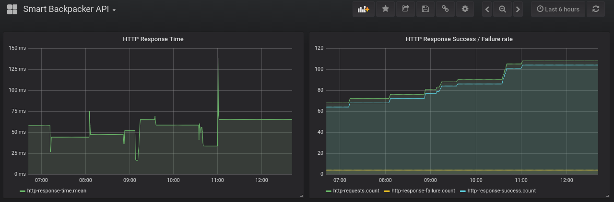

 Smart Backpacker
================

[](https://travis-ci.org/SmartBackpacker/core)
[](https://codecov.io/gh/SmartBackpacker/core)

[Smart Backpacker](http://smartbackpackerapp.com) is an App where you can find Visa Requirements information for any country in the world regardless of your nationality, currency exchange, health information and airline's baggage policy among others.

- Download it for `Android` [here](https://play.google.com/store/apps/details?id=io.github.gvolpe.sb).
- Download it for `iOS` [here](https://itunes.apple.com/us/app/smartbackpackerapp/id1322542121?ls=1&mt=8)

### Metrics Snapshot (12th Feb of 2018)



> Anybody with a GitHub account can view these metrics in real time on http://stats.smartbackpackerapp.com/

### Modules

#### Api

It's the main back-end application exposing the Http Rest API (See [documentation](http://docs.smartbackpackerapp.com/)). It also contains a token generator.

- Dependencies
    - [Fixer.io](http://fixer.io/) running on [localhost:8081](http://localhost:8081) using `docker-compose`. See the source code [here](https://github.com/hakanensari/fixer). Or you can also use the public API, just change the URL in the configuration.

#### Airlines

It contains the job to insert new airline's data using plain files as the source (`fs2.io` is used here).

#### Common

It contains some utils for `cats.effect.IO`, `fs2.Stream`, logging, testing, etc.

#### Scraper

It has all the html page parsers and scrapers and all the jobs to insert parsed data into the DB.

```
sbt project scraper
```

- Retrieve Visa Requirements from Wikipedia and persist it to the DB:
```
run visaRequirements
```

- Retrieve Visa Restrictions Index (Passport Ranking) from Wikipedia and persist it to the DB:
```
run visaRanking
```

- Retrieve Health information from CDC and persist it to the DB:
```
run healthInfo
```

- Insert initial data (Countries and Visa Categories) into the DB:
```
run loadCountries
run updateCountries
run loadVisaCategories
```


### Database

Smart Backpacker uses [PostgreSQL](https://www.postgresql.org/) as the main data storage.

### Tech Stack

We love Functional Programming. That's why we choose and support the [Typelevel](https://typelevel.org/) stack. We also use a few other dependencies (see `build.sbt` for more):

| Dependency    | Version    |
| ------------- |:----------:|
| cats          | 1.0.1      |
| cats-effect   | 0.8        |
| http4s        | 0.18.0     |
| circe         | 0.9.1      |
| doobie        | 0.5.0      |
| fs2           | 0.10.2     |
| monix         | 3.0.0-M3   |
| tsec-jwt-mac  | 0.0.1-M9   |
| scala-scraper | 2.0.0      |
| scalatest     | 3.0.3      |
| scalacheck    | 1.13.4     |

## LICENSE

Licensed under the Apache License, Version 2.0 (the "License"); you may not use this project except in compliance with
the License. You may obtain a copy of the License at http://www.apache.org/licenses/LICENSE-2.0.

Unless required by applicable law or agreed to in writing, software distributed under the License is distributed on an
"AS IS" BASIS, WITHOUT WARRANTIES OR CONDITIONS OF ANY KIND, either express or implied. See the License for the specific
language governing permissions and limitations under the License.
